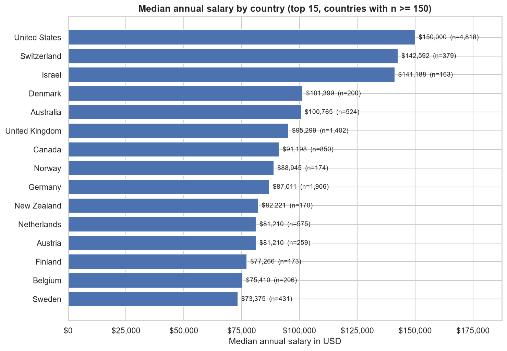
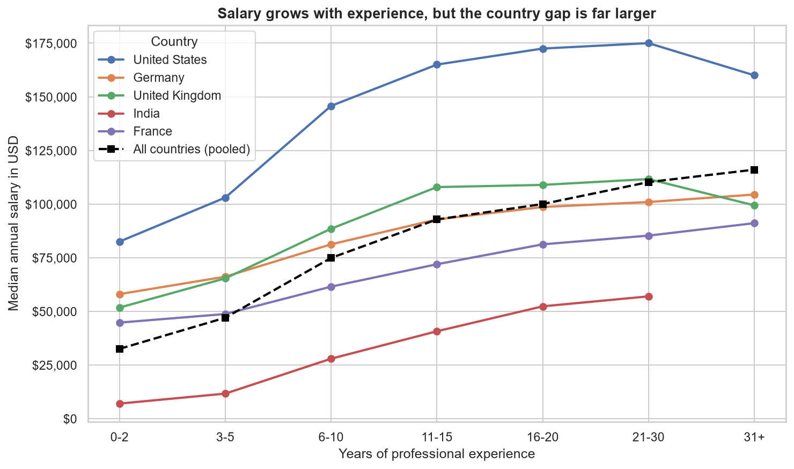
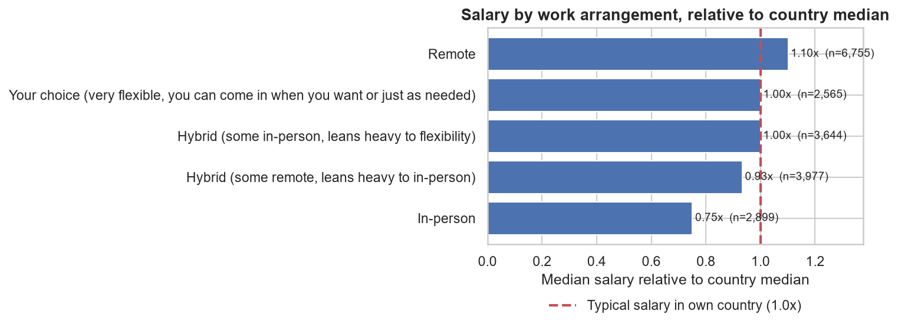
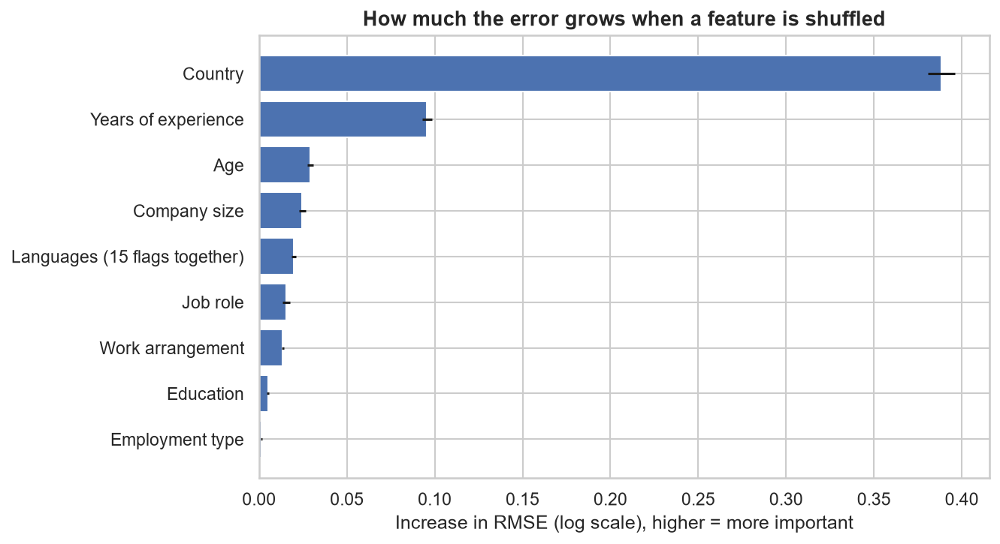

# Tech Salary Analysis


An end-to-end analysis of what drives tech salaries, using the **Stack Overflow Developer Survey 2025**: data cleaning with documented decisions, exploratory analysis, and a salary prediction model that reports an honest uncertainty range.

**Questions this project answers**

- How big are salary differences between countries, and how much do experience, education, job role, programming languages and remote work add on top of that?
- How accurately can a salary be predicted from survey answers, and how uncertain is each prediction?

## Key findings

Based on 21,702 respondents with a valid annual salary (USD). All comparisons are associations, not causal effects.

- **Country matters most.** The median salary is about **$150K in the United States** versus **$19K in India** (7.8x). In the prediction model, shuffling the country column hurts accuracy about four times more than shuffling years of experience.
- **Experience raises pay everywhere, but not equally.** In the United States the median grows about 2.1x between 0-2 and 21-30 years of experience; in India about 8.2x, so the gap between the two countries narrows from about 11.8x to 3.1x.
- **Remote work is associated with higher pay inside every large country.** In the United States the remote premium stays between +10% and +28% after grouping by experience.
- **Job role matters, and seniority explains only part of it.** Executives (1.60x), engineering managers (1.42x) and architects (1.29x) earn the most relative to their country's median; system administrators (0.67x) the least. AI/ML engineers (1.17x, median 8 years of experience) earn more than data scientists (0.95x).
- **Education and programming language show modest differences.** A Master's degree is associated with about 7% higher pay than a Bachelor's; most language differences stay within +/- 15%.
- **Salary is only partly predictable from these fields.** The best model explains about 59% of the variance of log salary and predicts 47% of salaries within 25% of the real value.

<p align="center">
  
</p>
<p align="center"><em>Median annual salary by country (countries with at least 150 respondents).</em></p>

<p align="center">
  
</p>
<p align="center"><em>Salary grows with experience in every country, but the country gap is far larger.</em></p>

<p align="center">
  
</p>
<p align="center"><em>Salary by work arrangement, relative to each respondent's country median.</em></p>

The full write-up with numbers and caveats is in [`reports/insights.md`](reports/insights.md).

## Salary prediction model

A gradient boosting model predicts the log of annual salary from 23 features (country, experience, job role, education, work arrangement, company size, age, employment type and the 15 most used languages). Results on a held-out test set of 4,341 respondents:

| Model | R2 (log scale) | Median absolute error | Within 25% of real salary |
|---|---|---|---|
| Global median | -0.03 | $37.5K | 29% |
| Country median | 0.45 | $23.9K | 40% |
| Ridge regression | 0.59 | $19.5K | 44% |
| Gradient boosting | 0.59 | $18.9K | 47% |

- **The country alone gets most of the way.** Predicting each respondent's country median already reaches R2 = 0.45; every other feature together adds about 0.14.
- **A simple linear model nearly ties** with gradient boosting on the log scale, so the remaining error is mostly information the survey does not contain (employer, specific skills, bonuses).
- **Prediction ranges are calibrated per country.** A single 80% range for all countries covered only 41% of salaries in Ukraine and 95% in Germany. Country-specific ranges (with one wider shared range for small countries) cover 80.4% of the test salaries overall.

<p align="center">
  
</p>

## How the data was cleaned

| Step | Rows remaining | Rows removed |
|---|---|---|
| Raw survey responses | 49,191 | - |
| Respondents with a valid, positive annual salary | 23,947 | 25,244 |
| Employed or self-employed respondents only | 22,550 | 1,397 |
| Inconsistent USD conversion (mostly tiny salaries) | 22,462 | 88 |
| Salary between $1,000 and $1,000,000 | 21,963 | 499 |
| Per-country outliers (3 x IQR on the log scale) | 21,702 | 261 |

Experience values that are impossible for the respondent's age group were set to missing (19 values) instead of dropping the rows.

## Methodology highlights

- **Medians, not means**, and salaries compared **relative to each respondent's country median**, so the large country effect does not distort role, language or education comparisons.
- **No target leakage:** the original salary and currency columns are excluded from the model, because they determine the target.
- **No data leakage:** the train/test split happens before any statistic is computed, and imputation and encoding live inside the scikit-learn pipeline.
- **Baselines first:** the model is judged against a global-median and a country-median baseline, not only against itself.
- **Uncertainty is part of the output:** every prediction comes with an 80% range whose coverage was verified on data not used to build it.

## Project structure

```
tech-salary-analysis/
├── data/
│   ├── README.md          # how to download the data, license note
│   ├── raw/               # results.csv, schema.csv (not tracked)
│   └── processed/         # generated by notebooks 02 and 03 (not tracked)
├── notebooks/
│   ├── 01_data_understanding.ipynb
│   ├── 02_data_cleaning.ipynb
│   ├── 03_outliers_and_validation.ipynb
│   ├── 04_eda_overview.ipynb
│   ├── 05_eda_roles_languages_remote.ipynb
│   └── 06_salary_regression_model.ipynb
├── src/
│   ├── features.py        # feature engineering shared by the notebook and the CLI
│   └── predict.py         # command line salary prediction
├── models/                # trained model, created by notebook 06 (not tracked)
├── reports/
│   ├── figures/           # charts used in this README
│   ├── insights.md        # detailed findings and caveats
│   └── model_metrics.csv
├── LICENSE
├── README.md
└── requirements.txt
```

## Reproduce the analysis

Tested with Python 3.13, pandas 3.0, scikit-learn 1.9.

```bash
git clone https://github.com/Zain-Wahbi/tech-salary-analysis.git
cd tech-salary-analysis
python -m venv .venv
# Windows: .venv\Scripts\activate    macOS/Linux: source .venv/bin/activate
pip install -r requirements.txt
```

1. Download `results.csv` and `schema.csv` and place them in `data/raw/` (see [`data/README.md`](data/README.md)).
2. Run the notebooks in order, from `01` to `06`. Notebooks 02 and 03 write the cleaned data to `data/processed/`, and notebook 06 saves the trained model to `models/`.

## Use the trained model

After running notebook 06, from the repository root:

```bash
python -m src.predict --country "United States" --experience 8 --role "Developer, back-end" --education "Bachelor's degree" --remote "Remote" --languages "Python;SQL;JavaScript"
```

The command prints the predicted annual salary and an 80% range. Optional fields left out (company size, age) are treated as unanswered. Run `python -m src.predict --help` for all options. Category values must match the survey wording used in the notebooks.

## Limitations

- Only about half of the survey respondents reported a salary, so results may be biased toward people comfortable sharing it.
- The sample is experienced (median 12 years of professional experience) and reflects Stack Overflow users, not all developers.
- The 2025 "Employed" category does not separate full-time from part-time work.
- Salaries are self-reported and cluster on round numbers, so headline figures are rounded.
- The model only sees survey answers, not the employer or the specific skills, so most of the variation within a country remains unexplained. Treat predictions as rough guides.
- Findings are associations from survey data, not causal effects.

## Data source and license

Data: [Stack Overflow Developer Survey 2025](https://survey.stackoverflow.co/), published by Stack Overflow under the Open Database License (ODbL) 1.0. This repository does not redistribute the data. The code is released under the MIT License. This is an independent learning project and does not represent official conclusions from Stack Overflow.

## Author

Zain Wahbi, [github.com/Zain-Wahbi](https://github.com/Zain-Wahbi)